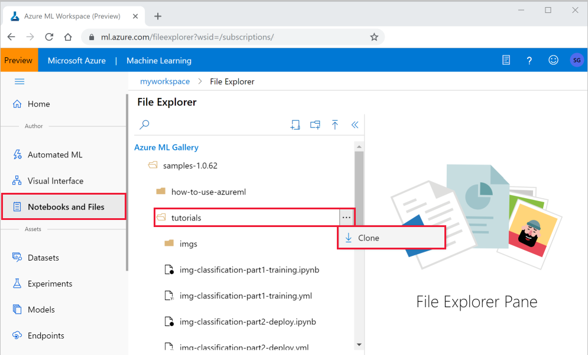
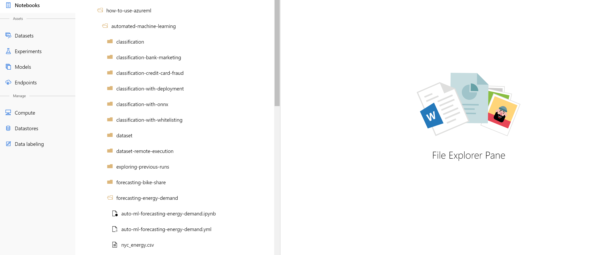
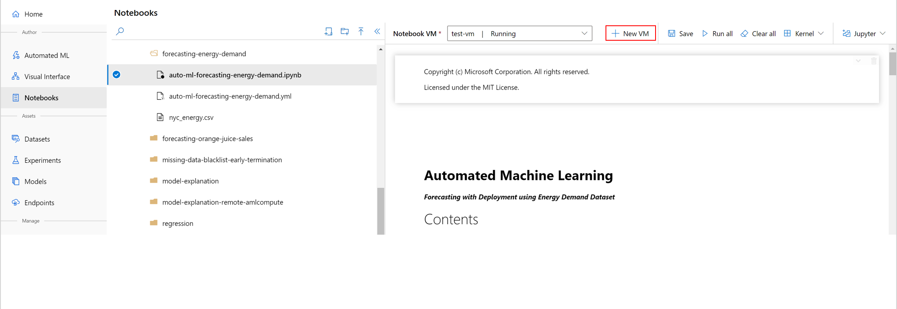

# Ignite Workshop Guide: Automated Machine Learning

## About
In this workshop, you will use automated machine learning in Azure Machine Learning to create a forecasting model to predict NYC energy demand. This process accepts training data and configurations settings, and automatically iterates through combinations of different feature normalization/standardization methods, models, and hyperparameter settings to arrive at the best model.

## Requirements
+ <b>Azure Subscription</b> -
Try [free of paid version](https://azure.microsoft.com/en-us/free/services/machine-learning/) of Azure Machine Learning today.

<!-- ------------------------------------ -->
## Clone a notebook folder

This example uses the cloud notebook server in your workspace for an install-free and pre-configured experience.

You complete the following experiment set-up and run steps in the workspace landing page (preview), a consolidated interface that includes machine learning tools to perform data science scenarios for data science practitioners of all skill levels.

1. Sign in to the [workspace landing page](https://ml.azure.com/).

1. Select your subscription and the workspace you created.

1. Select **Notebooks and Files** on the left.

1. Open the **samples** folder.

1. Select the **"..."** at the right of the **how-to-use-azureml** folder and then select **Clone**.

    

1. There is a folder displayed for each user who accesses the workspace.  Select your folder to clone the **how-to-use-azureml**  folder there.

## Select a VM to run the notebook

1. Under **User Files** open your folder and then click through the following directories **how-to-use-azureml/automated-machine-learning/forecasting-energy-demand**.

    

    > [!IMPORTANT]
    > You can view notebooks in the **samples** folder but you cannot run a notebook from there.  In order to run a notebook, make sure you open the cloned version of the notebook in the **User Files** section.
    
1. Select the **auto-ml-forecasting-energy-demand.ipynb** file in the **forecasting-energy-demand** folder.

1. On the top bar, select a Notebook VM to use to run the notebook. These VMs are pre-configured with everything you need to run Azure Machine Learning. You can select a VM created by any user of your workspace. 

1. If no VMs are found, select **+ New VM** to create the VM.

    

    1. When you create a VM, provide a name.  The name must be between 2 to 16 characters. Valid characters are letters, digits, and the - character, and must also be unique across your Azure subscription.

    1. Then select **Create**. It can take approximately 5 minutes to set up your VM.

1. Once the VM is available it will be displayed in the top toolbar.  You can now run the notebook either by using **Run all** in the toolbar, or by using **Shift+Enter** in the code cells of the notebook.

1. The Jupyter notebook contain step by-step guidance onconfiguration, training, exploration, and operationalization of an machine learning model.